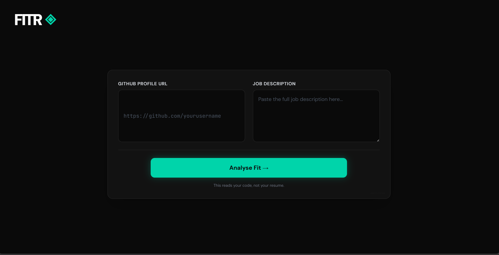
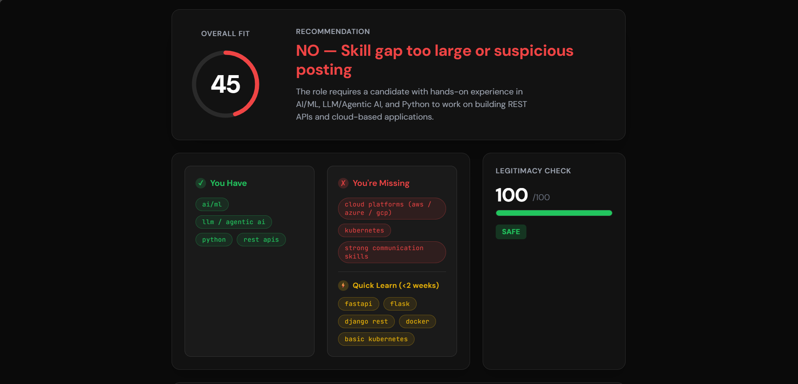
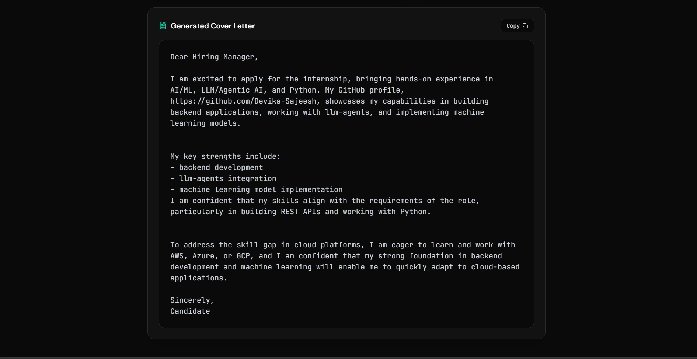

<p align="center">
  
</p>

# Fitr ◈ — Internship Fit Intelligence Engine 🎯

## Basic Details

### Team Name: Fitr

### Team Members
- Member 1: Devika Sajeesh - College of Engineering Trivandrum

### Hosted Project Link
[https://devika-sajeesh.github.io/Fitr](https://devika-sajeesh.github.io/Fitr)

### Project Description
Fitr is an AI-powered internship fit engine that reads your GitHub repositories like a senior engineer would, deconstructs job descriptions like a hiring manager would, and tells you exactly how qualified you are — and how to close the gap. It also flags fake and scam internship postings before you waste time applying.

### The Problem Statement
Students apply to internships on platforms like Internshala, LinkedIn, and Unstop every day and get rejected — not because they aren't qualified, but because keyword-based matching systems can't see their real skills. A student with 25 Python projects gets rejected for missing one buzzword. Meanwhile, scam internships asking for registration fees look identical to legitimate ones. There is no tool that reads what you've actually built and tells you honestly where you stand.

### The Solution
Fitr runs a 4-stage AI pipeline: it scrapes your public GitHub repositories to build a real competency map from your actual code, then uses a Groq-powered LLM to deconstruct the job description into hard requirements and nice-to-haves, scores your fit using a weighted formula that prioritises hard skill matches, detects scam red flags, and generates a personalised cover letter that cites your actual projects and addresses your skill gaps constructively.

---

## Technical Details

### Technologies/Components Used

**For Software:**
- Languages used: Python, JavaScript, HTML, CSS
- Frameworks used: FastAPI, TailwindCSS
- Libraries used: PyGithub, LangChain, langchain-groq, python-dotenv, uvicorn
- Tools used: Groq LPU Inference Engine (Llama 3.3 70B), Git, GitHub Pages, Render

---

## Features

- **GitHub-Native Skill Inference:** Analyses your actual repositories using language stats and dependency files — not your self-reported resume skills
- **Intelligent JD Deconstruction:** LLM separates hard requirements from nice-to-haves and identifies skills learnable in under 2 weeks
- **Weighted Fit Scoring:** Composite score (hard match 85% + legitimacy 15%) with a clear YES / BORDERLINE / NO recommendation
- **Scam Detection:** Rule-based red flag engine checks for registration fees, vague deliverables, unpaid mandatory work, and 9 other patterns with a legitimacy score out of 100
- **Personalised Cover Letter:** Groq LLM generates a 150-word cover letter citing your specific GitHub projects and addressing skill gaps proactively

---

## Implementation

### For Software:

#### Installation
```bash
git clone https://github.com/Devika-Sajeesh/Fitr.git
cd Fitr
python -m venv venv
source venv/bin/activate  # Windows: venv\Scripts\activate
pip install -r requirements.txt
```

Create a `.env` file in the root directory:
```
GITHUB_TOKEN=your_github_personal_access_token
GROQ_API_KEY=your_groq_api_key
```

Get your keys:
- GitHub token: github.com/settings/tokens → Generate classic token → check `public_repo`
- Groq API key: console.groq.com → API Keys → Create key (free, no credit card)

#### Run
```bash
uvicorn main:app --reload
```

Open `frontend/index.html` in your browser. The frontend calls the FastAPI backend at `http://localhost:8000`.

---

## Project Documentation

### For Software:

#### Screenshots (Add at least 3)







#### Diagrams

**System Architecture:**

```
GitHub URL + JD Text
        │
        ▼
┌───────────────────┐
│  Stage 1          │
│  GitHub Ingestor  │ ← PyGithub API
│  (Competency Map) │
└────────┬──────────┘
         │
         ▼
┌───────────────────┐
│  Stage 2          │
│  JD Analyser      │ ← Groq LLM (Llama 3.3 70B)
│  + Red Flag Check │
└────────┬──────────┘
         │
         ▼
┌───────────────────┐
│  Stage 3          │
│  Fit Scorer       │ ← Weighted formula
│  (0–100 score)    │
└────────┬──────────┘
         │
         ▼
┌───────────────────┐
│  Stage 4          │
│  Cover Letter     │ ← Groq LLM (Llama 3.3 70B)
│  Agent            │
└────────┬──────────┘
         │
         ▼
    Results Dashboard
```

**Fit Scoring Formula:**
```
hard_match  = (matched hard skills / total hard skills) × 85
legitimacy  = legitimacy_score × 0.15

final_score = hard_match + legitimacy  (max 100)
```

---

## Additional Documentation

### API Documentation

**Base URL:** `http://localhost:8000`

---

**POST /ingest**
- **Description:** Scrapes a GitHub profile and returns a competency map of inferred skills
- **Request Body:**
```json
{
  "github_url": "https://github.com/username"
}
```
- **Response:**
```json
{
  "competency_map": {
    "Python": 0.91,
    "nlp": 0.78,
    "backend": 0.82,
    "deep-learning": 0.65
  }
}
```

---

**POST /analyse**
- **Description:** Parses a job description using LLM and runs red flag detection
- **Request Body:**
```json
{
  "jd_text": "We are looking for a Python developer with FastAPI experience..."
}
```
- **Response:**
```json
{
  "hard_skills": ["Python", "FastAPI", "REST APIs"],
  "quick_learn_skills": ["Docker", "AWS"],
  "role_summary": "Backend Python developer internship",
  "stipend": "₹15,000/month",
  "red_flags": [],
  "legitimacy_score": 100
}
```

---

**POST /fit**
- **Description:** Calculates fit score from competency map and JD analysis
- **Request Body:**
```json
{
  "competency_map": {"Python": 0.91, "backend": 0.82},
  "jd_analysis": {"hard_skills": ["Python", "FastAPI"], "quick_learn_skills": ["Docker"], "legitimacy_score": 100}
}
```
- **Response:**
```json
{
  "fit_score": 78,
  "hard_matched": ["Python", "FastAPI"],
  "hard_missing": [],
  "quick_learn_missing": ["Docker"],
  "recommendation": "YES — Apply with confidence",
  "legitimacy_score": 100
}
```

---

**POST /full-analysis**
- **Description:** Runs all 4 stages in sequence and returns the complete result including cover letter
- **Request Body:**
```json
{
  "github_url": "https://github.com/username",
  "jd_text": "Full job description text here..."
}
```
- **Response:**
```json
{
  "competency_map": {},
  "jd_analysis": {},
  "fit_result": {
    "fit_score": 78,
    "hard_matched": ["Python", "LLM"],
    "hard_missing": [],
    "quick_learn_missing": ["Kubernetes"],
    "recommendation": "YES — Apply with confidence",
    "legitimacy_score": 95
  },
  "cover_letter": "I'm excited to apply..."
}
```

---

**POST /demo**
- **Description:** Returns a hardcoded realistic demo response — use this if API keys are unavailable
- **Request Body:** None required
- **Response:** Full analysis result for a sample Python/ML developer profile

---

## Project Demo

### Video
[\[demo video link \]](https://www.loom.com/share/1f1ac03d824b4da3b98e8827e4e59b3e)

### Additional Demos
- Live site: [https://tink-her-hack-temp-1bfw.onrender.com](https://tink-her-hack-temp-1bfw.onrender.com)
- Backend API docs: `http://localhost:8000/docs` (run locally)

---

## AI Tools Used

**Tool Used:** Claude (Anthropic), Groq (Llama 3.3 70B)

**Purpose:**
- Claude: Architecture planning, code generation for all 4 pipeline stages, debugging assistance, prompt engineering for JD parser and cover letter agent
- Groq / Llama 3.3 70B: Runtime LLM for JD deconstruction and cover letter generation within the app itself

**Key Prompts Used:**
- "Write a Python function get_competency_map(github_url) using PyGithub that infers skills from repo language stats and requirements.txt"
- "Create a LangChain chain that parses a job description into structured JSON with hard_skills, nice_to_have, and role_summary"
- "Fix the scoring formula to weight hard skill matches at 60%, soft matches at 25%, legitimacy at 15%"
- "Generate a FastAPI app with CORS middleware and 5 POST routes for a 4-stage internship fit pipeline"

**Percentage of AI-generated code:** ~60%

**Human Contributions:**
- Problem identification from personal experience with internship rejections
- System architecture and pipeline design decisions
- Skill taxonomy JSON (manual curation of 40+ library → skill mappings)
- Red flag keyword list (domain knowledge of internship scam patterns)
- Fit scoring formula design and weightings
- Integration, testing, debugging across all stages
- UI/UX design decisions and frontend flow

---

## Team Contributions

- Devika Sajeesh: Full stack — system architecture, GitHub ingestor, JD analyser, fit scorer, cover letter agent, FastAPI backend, frontend UI, deployment

---

## License

This project is licensed under the MIT License - see the [LICENSE](LICENSE) file for details.

---

Made with ❤️ at TinkerHub Tink-Her-Hack 4.0